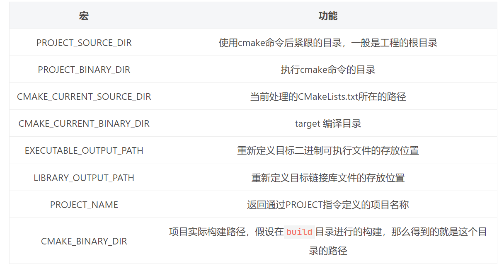

## 概念  
* cmake是一个项目构建工具，比``makefile``更加高级一些，CMake支持跨平台  
* CMake根据不同的平台生成makefile文件  
* 大概过程：cmakelists.txt（指定指令）-cmake->makefile-make->....  
* 大多数IDE都是继承了make的  
### CMake命令执行流程：  
1. 编写CMakeLists.txt文件，下面是基本的配置  
```makefile
	cmake_minimum_required(VERSION 3.20) # 最小版本
	project(Hello)  # 项目名
	add_executable(Hello hello.cpp)  # 由源文件生成一个可执行的程序
```
2. ``cmake -B build [-G"MinGW Makefiles]"`` 创建一个build并在此目录下生成makefile或其他文件  
3. ``cmake --build build`` 生成项目  

## Windows下使用CMake构建项目  
* <a href="https://cmake.org/download/">官网下载</a>  


## cmake语法  
* ``cmake -P xxx.cmake`` 可以直接执行cmake文件  
### message  
* ``message("xxx")`` 输出语句  
* 里面可以不需要带``""``，但是如果换行需要，或者``[[]]``-lua  
* 获取版本信息：``message(${CMAKE_VERSION})``  
* 获取系统的中的环境变量path：``message($ENV{PATH})``  

### set、list变量操作  
#### set  
* set语法：``set(<variable> <value>[;/ ]<value>... [PARENT_SCOPE])``  
* 变量内部存在多个值内部存储使用``;``分隔，实际并不会显示，而是直接连接在一起的  
* 在当前项目增加环境变量：  
	- ``set(ENV{CXX} "g++")``  
* 删除变量值 unset()  
#### list  
* list常用方法：  
1. ``list(APPEND <list> [<element>...])``列表添加元素  
2. ``list(REMOVE_ITEM <list> <element> [<element>...])``列表删除元素  
3. ``list(LENGTH <list> <output varible>)``获取列表元素个数  
4. ``list(FIND <list> <value> <out-var>)``列表中查找元素返回索引  
5. ``list(INSERT <list> <index> [<element>...])``在列表index位置插入  
6. ``list(REVERSE <list>)``反转list  
7. ``list(SORT <list> [...])``排序list  

### 流程控制  
#### 条件控制  
```c++
if(...)
	# ...
elseif(...)
	# ...
else()
	# ...
endif()
```

* 逻辑判断中：存在关键字:``NOT、AND、OR、LESS(小于)、EQUAL(等于)``  

#### 循环流程控制  
```cmake
foreach(<loop_var> RANGE <max>)
	# ...
endforeach()

foreach(<loop_var> RANGE <min> <max> [<step>])  
foreach(<loop_var> IN [LISTS <lists>] [ITEMS <items>])

while(...)
	# ,,,
endwhile()
```

* ``[ITEMS <items>]`` 在遍历完后会进入循环  

#### ZIP  
* ``foreach(num IN ZIP_LISTS L1 L2)`` 可以将L1和L2列表拼接在一起然后遍历  
	- 访问``${num_0}${num_1}``分别对应L1和L2的  


### 函数  
```cmake
	function(<name> [参数列表名])  
		# ...
	endfunction()
```

* 在函数内部使用系统变量``CMAKE_CURRENT_FUNCTION`` 打印当前函数名？  
* 函数内部使用参数列表的每个参数：``ARGV0、ARGV1...``  

### camke作用域  
* 存在两种作用域：1.函数作用域 2.文件作用域？（父子之间存在继承关系）  
* 值传递  

### cmake宏  
```cmake
	macro(<name> [<argument...>])
		# ...
	endmacro()
```

* 大道至简，就是替换的意思  

## cmake构建项目的方式  
### 直接写入源码路径的方式  
* ``add_executable()`` 直接加入源码（.cpp）相对路径，但是头文件中也需要相对路径引入(并且不需要指定头文件目录)  
* 只适用于小型项目  

### 调用子目录中cmake脚本的方式  
* include方法可以引入子目录中的cmake后缀的配置文件，将配置加入add_executable中  
* 比如cmake文件中可以设置所有的源文件到一个变量中  
* ``include(cmake后缀文件目录)``  

### CMakeLists嵌套  
* 常用的命令：  
	1. ``target_include_directories(项目名 PUBLIC 头文件目录)`` 头文件目录的声明  
	2. ``target_link_libraries(<target>  <PRIVATE|PUBLIC|INTERFACE> <item>...  [<PRIVATE|PUBLIC|INTERFACE> <item>...]...)`` 连接动态库文件  
		- target：指定要加载动态库的文件的名字  
		- PRIVATE|PUBLIC|INTERFACE：动态库的访问权限，默认为PUBLIC  
		- 如果各个动态库之间没有依赖关系，无需做任何设置，三者没有没有区别，一般无需指定，使用默认的 PUBLIC 即可。动态库的链接具有传递性，如果动态库 A 链接了动态库B、C，动态库D链接了动态库A，此时动态库D相当于也链接了动态库B、C，并可以使用动态库B、C中定义的方法。  
		- 在cmake中指定要链接的动态库的时候，应该将命令写到生成了可执行文件之后  
		- 命令可以链接动态库，也可以链接静态库文件。  
	3. ``link_libraries(<static lib> [<static lib>...])`` 链接静态库文件  
	4. ``link_directories(<lib path>)`` 指定链接库路径  
	5. ``add_subdirectory`` 添加子目录  
	6. ``add_library`` 生成库文件  
		- ``add_library(库文件名 库类型 源码文件)``  
		- STATIC静态文件、SHARED动态文件  
	7. ``include_directories(headpath)`` 包含头文件  

## 搜索文件  
* ``aux_source_directory(<dir> <variable>)`` 搜索对应的目录的所有源文件，添加到变量中  
* ``file(GLOB/GLOB_RECURSE 变量名 要搜索的文件路径和文件类型)``  
	- GLOB: 将指定目录下搜索到的满足条件的所有文件名生成一个列表，并将其存储到变量中。  
	- GLOB_RECURSE：递归搜索指定目录，将搜索到的满足条件的文件名生成一个列表，并将其存储到变量中。  
	- 文件类型诸如：``*.h/*.cpp``  

## cmake一些常用宏  
1. ``PROJECT_BINARY_DIR`` 生成的build的文件夹目录  
2. ``PROJECT_SOURCE_DIR`` 使用cmake命令时，后面紧跟的目录，一般为工程的根目录  
3. ``CMAKE_CXX_STANDARD`` C++标准宏，可以设定C++版本  
	- ``set(CMAKE_CXX_STANDARD 17) => -std=c++17``  
4. ``EXECUTABLE_OUTPUT_PATH`` 执行文件时可执行程序输出的路径，通过set设置  
5. ``CMAKE_CURRENT_SOURCE_DIR`` 宏表示当前访问的 CMakeLists.txt 文件所在的路径。  
6. ``LIBRARY_OUTPUT_PATH`` 可以设置动静态库的生成路径  
7. CMAKE添加宏：``add_definitions(-D宏名称)``  

  


## 命令总结
### 开始  
#### cmake_minimum_required  
* 指定cmake的最低执行版本，如果cmake安装版本低于此版本报error  
```cmake
cmake_minimum_required(VERSION 3.30.0)
```

#### project  
* 指定项目名称、版本号、描述、仓库链接、使用语言  
```cmake
project(algotest
    VERSION 0.0.1
    DESCRIPTION "This platform provides me with the ability to test various algorithms on a daily basis."
    HOMEPAGE_URL "https://github.com/qihaichiaki/AlgorithmicTests"
    LANGUAGES CXX
)
```

#### CMAKE_CXX_STANDARD  
* 使用set限制cxx版本，如果使用``CMAKE_CXX_STANDARD_REQUIRED`` 可以强制限制  
```cmake
set(CMAKE_CXX_STANDARD 17)
```

#### CMAKE_BUILD_TYPE  
* DEBUG、RELEASE  
* 命令行中使用：``cmake -DCMAKE_BUILD_TYPE=Release ..``指定  

### 生成可执行文件/库之前  
#### add_subdirectory  
* 将对应子目录中的CMakeLists.txt 文件引入到项目构建流程中，方便多模块化管理。并且在父区域设置的cmake变量也会传递到子CmakeLists.txt 文件中去  
```cmake
add_subdirectory(src)
```

#### file  
* 通常使用file命令查找对应目录下的源文件，可以进行递归的去查询。找到的所有文件会在一个列表中，方便引入可执行文件需要编译的编译单元  
```cmake
file(GLOB_RECURSE DIR_SRCS "src/*.cpp")
```

#### CMAKE_RUNTIME_OUTPUT_DIRECTORY  
* 将当前项目的生成exe以及动态库全部放到对应的文件夹下去 ，windows下？ 
```cmake
set(CMAKE_RUNTIME_OUTPUT_DIRECTORY "${CMAKE_BINARY_DIR}/bin")
```

#### CMAKE_MODULE_PATH  
* 当要寻找第三方cmake中的相关文件，即后续使用findpackage找包时，需要list ADDEND到里面去  
```cmake
list(APPEND CMAKE_MODULE_PATH "../cmake")
```

#### find_package  
* 找三方的cmake文件用来添加对应的依赖,REQUIRED设置必须find到才能进行下一步  
* 后续需要进行links，别忘记了  
```cmake
find_package(依赖名 REQUIRED)
```

#### link_directories  
* 如果没有在当前项目中指定、或者生成库。那么需要找到对应库的位置，则需要使用此命令添加静态库路径  
```cmake
link_directories(path)
```

#### MSVC使用utf-8执行字符集

```cmake
add_compile_options("$<$<C_COMPILER_ID:MSVC>:/utf-8>")
add_compile_options("$<$<CXX_COMPILER_ID:MSVC>:/utf-8>")
```

### 生成可执行程序/库  

#### add_executable  
* 生成目标可执行程序
```cmake
add_executable(${CMAKE_PROJECT_NAME} file...)
```

#### add_library
* 生成静态库、动态库(STATIC、SHARED)  
* ``CMAKE_LIBRARY_OUTPUT_DIRECTORY``和``CMAKE_ARCHIVE_OUTPUT_DIRECTORY``可以指定生成库的输出目录（第一个适用于动态库、第二个适用于静态库）  
* 或者动态库、静态库均可使用的``LIBRARY_OUTPUT_PATH`` 进行指定  
```cmake
add_library(common
SHARED
${DIR_SRCS}
)
```

#### build_type  
* cmake构建的时候可以指定构建类型。  
* 常规下，在GNU cmake配置下或者说是单配置生成器，使用``CMAKE_BUILD_TYPE``即可进行指定，而在msvc cmake或者说是符合配置生成器，使用``CMAKE_CONFIGURATION_TYPES``即可指定(需要注意，复合时这个可以不需要指定，在最后``cmake --build build -config Release`` 即release构建选项)  
* Debug、Release  

### 生成可执行文件/库之后  
#### target_include_directories  
* 指定对应的项目名称包含对应的include文件  
```cmake
target_include_directories(common
PUBLIC
"${CMAKE_SOURCE_DIR}/include"
)
```

#### target_link_libraries  
* 链接动静态库  
```cmake
target_link_libraries(my_target
PUBLIC
common
)
```

#### target_compile_definitions  
* 添加宏定义，其中PRIVATE、PUBLIC、INTERFACE可以更加细粒度的控制宏的生效范围（仅目标对象、目标对象和所有依赖其的对象、对依赖其的对象有效，自身无效）  
```cmake
target_compile_definitions(my_target
    PRIVATE MY_MACRO=1
    PUBLIC MY_OTHER_MACRO
)
```

### CTest测试  
#### enable_testing  
* ``enable_testing()`` 设置启动测试  

#### add_test  
* 设置测试名称和指定对应需要测试可执行程序  
```cmake
add_test(
	NAME test
	COMMAND ${PROJECT_NAME}
)
```