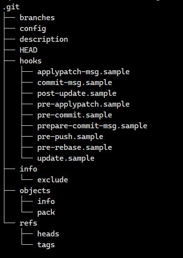
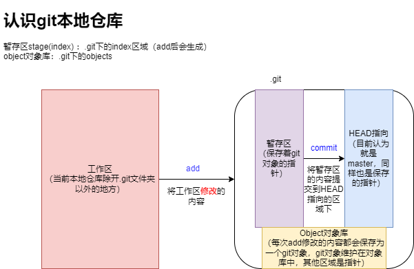

## git本地仓库初始化结构
  

## git本地仓库提交过程  
  

## git的安装和卸载  
### 查看是否安装成功  
```bash
	git --version
```

### Linux-centos下的安装与删除  
```bash
	sudo yum remove git -y
	sudo yum install git -y
```

## 初始化git本地仓库  
* 在当前目录会创教一个初始化Git本地仓库,新增 .git/存在很多文件，它是用来追踪管理Git仓库的，记住不可修改里面的内容  
```bash
	git init
```
<a href="#git本地仓库初始化结构">git本地仓库初始化结构展示图</a>


## git配置本地仓库  
* 刚初始化的仓库需要相关配置，比如用户名和email地址，并且可以选择本地和全局设置  
### 查看本地仓库配置  
```bash
	git config -l
```

### 配置用户  
* 注意，git中，存在两个用户名，一个全局用户名，一个本地特定项目用户名。全局使用--global选项进行配置。

```bash
	git config user.name "qihai" 		  # 设置本地用户  
	git config --unset user.name          # 删除本地用户
	git config --global user.name "qihai" # 全局设置用户 
	git config --global --unset user.name # 全局删除用户  
```

### 配置用户邮箱  
* 同理，git存在全局用户邮箱和本地用户邮箱，可以分开设置也可以一起设置，互相之间并不冲突  
```bash
	git config user.email "地址" 			  # 设置本地邮箱  
	git config --unset user.email          # 删除本地邮箱
	git config --global user.email "地址"    # 全局设置邮箱 
	git config --global --unset user.email # 全局删除邮箱  
```

## 查看本地仓库状态（工作区、暂存区、版本库之间的差别）  
```bash
	git status  # 查看当前本地仓库状态，不知道修改的细节，只能看到哪些文件被修改了
	git diff  # 显示暂存区和工作区之间的差异，存在修改的细节  
	git diff HEAD  # 查看版本库和工作区文件的区别，存在修改的细节
```

## git核心操作1：工作区文件提交版本库管理  
### 提交工作区修改内容到暂存区(索引)  
* 暂存区（索引）对应.git中的index，其中保存的是add后创建对应git对象的id  
```bash
	git add 指定文件1 指定文件2...  # 指定修改文件提交
	git add . # 将当前目录下所有修改的文件提交  
	git add -f 文件名  # 忽略.gitinore文件规则限制，进行提交到暂存区
```

### 将暂存区内容提交版本库管理,并且上传提交日志  
```bash
	git commit -m "日志内容" [-m "日志内容"]  # 后面的-m是可以进行分行提交日志的  
```

## 忽略文件提交相关  
* 在git工作区中，可以配置文件**``.gitignore``** 对一些特殊文件进行忽略提交，相关简单规则如下：  
> 文件名 这可以是一个普通文件名，也可以是文件夹名字。文件名的话就表示在此目录下此文件不可被上传，文件夹名的话表示在此目录下（以及所有子目录）的所有含有此文件名的文件夹不可上传（包括文件夹里面的内容）  
> ``*后缀`` 指定后缀文件不可上传。  
> ``!`` 当然，上面的符号在最前面加上一个!就表示可以上传这个啦  
> ``#`` 后面可以进行注释

```bash
	git check-ignore -v 文件名  # 可以查看对应文件为什么被忽略了。查看的是对应的.gitinore文件内的忽略对应行。
```

## 打印提交日志  
```bash
	git log  # 打印出从近到远的提交日志  
	git log --pretty=oneline  # 打印一行漂亮可观的日志  
	git reflog  # 打印本地的每次提交命令，不会随着版本回退而得到修改，里面存在的短id仍然可以用于回退、查看git对象使用  
	git log --graph --abbrev-commit  # 图示的形式显示日志，后面是对id进行缩写，方便查看分支合并相关日志  
```

## 查看git对象  
* 一般查看日志里对应提交记录的git对象（或者对应版本库分支下保存的最新git-id），里面保存着1（tree记录此次修改文件文件id的git对象id，parent上一次修改文件id的git对象信息）2（提交者，提交者user信息）  
* 查看实际修改文件的内容，需要找到保存对应id的git对象，然后查看其中保存的id-git对象中的内容即可（两层嵌套）  
```bash
	git cat-file -p id
```

## git核心操作2：版本回退功能  
```bash
	git reset --mixed gitId  # 默认，将版本库和暂存区回退到指定ID的版本  
	git reset --soft gitId  # 将版本库回退到指定ID的版本  
	git reset --hard gitId  # 将版本库、暂存区和工作区回退到指定ID的版本  
	git reset --hard HEAD  # 回退到当前版本，HEAD^ 为上一个版本，依次类推
```

## git撤销工作区文件修改  
* 注意此处修改必须是之前已经被版本库管理的文件，意思是新建的文件不在此范围内  
```bash
	git checkout -- 撤销文件名  # 将工作区文件回到最近依次add/commit状态  
	git checkout  # 查看当前工作区可以撤回修改的文件  
```

## 删除git管理文件  
```bash
	git rm 文件名  # 此处操作相当于首先rm工作区文件，然后add到缓存区的操作
```

## 查看分支  
```bash
	git branch  # 本地仓库的所有分支  
	git branch -r  # 查看远程仓库的分支  
	git branch -a  # 查看远程和本地的全部分支  
	git branch -vv  # 查看本地分支和远程分支连接的状态  
```

## 创建分支  
* 会在.git目录中refs/heads创建一个新的分支，默认创建的就是master分支  
```bash
	git branch 分支名
```

## 切换分支  
* .git中HEAD文件保存的是当前分支的路径，当前分支前面会显示``*``  
* 注意，如果当前分支工作区、暂存区内容没有commit即提交到版本库中去的话，会留给下一个切换的分支。所以工作区可以提前隔离  
```bash
	git checkout 分支名
	git checkout -b 分支名  # 此命令可以省略创建对应分支的过程，可以看作：创建分支并且切换到对应分支下
```

## 删除分支  
```bash
	git branch -d 分支名  # 注意，如果对应分支在commit提交到版本库的情况下没有marge则不会进行删除，git会保护其分支
	git branch -D 分支名  # 强制删除
```


## 合并分支  
* 默认情况下为fast-forward模式进行合并，此合并类似于新增效果，没有冲突产生（日志中不会显示merge进来）  
* 如果产生冲突，则不会ff默认进行合并，而是修改冲突文件位置，需要程序员自行修改，然后add、commit操作完成这次合并（no-ff模式）  
* 合并冲突发生的原因：两个分支合并的时候都对对应文件发生了修改，此时不知道依照哪个方法进行修改，产生了冲突  
```bash
	git merge 分支名  # 当前分支和对应分支进行合并，默认为ff模式  
	git merge --no-ff -m "日志" 分支名  # 一no-ff模式合并，如果冲突，此处commit同样失效，需要重新add和commit
```

## 工作区暂存  
```bash
	git stash  # 此时工作区的内容被暂存了
	git stash list  # 查看存储状态
	git stash pop  # 将暂存的工作区内容释放到工作区中  
```

## 克隆远程仓库  
```bash
	git clone url  # https链接克隆远程仓库   
	git clone git@...  # ssh克隆 需要将本地ssh公钥上传到对应的远程仓库进行配置  
```

* 注意，生成rsa密钥：``ssh-keygen -t rsa -C "邮箱"``  邮箱和码云上的邮箱一致  
* 获取rsa公钥内容配置到远程仓库管理中：``cat ~/.ssh/id_rsa.pub``  

## 查看远程仓库信息  
```bash
	git remote  # 查看远程仓库名字
	git remote -v  # 查看远程仓库详细信息  
	git remote show origin  # 展示远程分支状态
	git remote prune origin  # 对陈旧的分支进行修改
```

## 推送至远程仓库  
```bash
	git push 远程仓库名 本地分支:远程分支  # 远程仓库名默认origin，如果本地分支和远程分支为同一个，可以省略一个 注意如果远程分支没有创建，push时会创建一个
```

* 注意：git push简写的时候需要建立连接方可push成功  

## 从远程仓库拉取到本地  
```bash
	git pull 远程仓库名 远程分支:本地分支  # 同理，pull本质是拉取+合并
```

## 拉取远程仓库的一个分支到本地新分支
```bash
	git checkout -b <new-branch-name> origin/<branch-name>
```

## git命令起别名  
```bash
	git config [--global] alias.别名 '命令'  
```

## git标签  
### git给commit-id添加标签  
```bash
	git tag  # 查看当前本地仓库下所有标签
	git tag 标签名  # 给最新一次commit提交版本库管理的git对象起标签  
	git tag 标签名 commit-id  # 给对应的git对象起标签  
	git tag 标签名 -m "描述"  # 给对应的标签添加描述-(注意在创建标签的时候)  
```

### git查看标签信息  
* 查看标签对应的git对象详细信息  
```bash
	git show 标签名
```

### git删除标签  
```bash
	git tag -d 标签名
```

### 向远程仓库推送标签  
```bash
	git push origin 标签名
	git push origin --tags  # 一次性推送所有标签  
	git push origin :标签名   # 本地删除对应标签，同步将远程仓库中的标签给删除掉  
```

## 本地分支和远程分支建立连接  
```bash
	git checkout -b 本地分支 origin/远程分支  # 创建分支时进行连接
	git branch --set-upstream-to=origin/远程分支 本地分支  # 根据远程分支创建本地分支
	git branch --set-upstream-to=origin/name  # 当前本地分支连接远程分支
	git branch -u origin/name  # 当前本地分支连接远程分支  
```

## 删除远程分支  
```bash
	git push origin :origin/远程分支名  
```

## git子模块
### git 添加子模块
```bash
git submodule add <GIT_URL> <存放路径>
```

### git 初始化和更新子模块
```bash
git submodule update --init --recursive
```


## 其他常用命令总结
- git remote update origin --prune （git更新远程分支）
- git fetch origin （将远程仓库更新到本地）
- git fetch --prune (删除本地记录的远程仓库已经删除的分支)
- git cherry-pick origin/api~7..origin/api
> 选择远程 origin/api 分支的最新 7 次提交commit到当前分支上  
> 或者使用git cherry-pick commit 单个单个将commitpick过来，建议先历史后新
- 一般rebase后，需要git push --force强制推送，rebase中的squash 用来合并提交
- git checkout -b <new-branch-name> origin/branch 将远程分支拉下来本地新建分支 
- git merge --abort 用于git pull 合并冲突时中止解决冲突，回到之前的状态。
- git rebase --abort 适合终止 rebase的相关命令
- git commit --amend 修改最近一次的提交信息，将本地应用到上一次的commit
- git clone -b <branch_name> <repository_url> clone仓库的其他分支
- git 配置代理服务器：git config --global https.proxy "http://<代理服务器url>"
- git 取消配置全局代理服务器 git config --global --unset https.proxy
- 查看当前项目下的子模块 `git submodule`(如果第一个字符是`-`那么说明没有初始化(本地和远程仓库并没有连接上))
- 初始化/更新项目子模块 `git submodule update --init`
- `git reset --hard origin/main` 强制更新为远程分支
